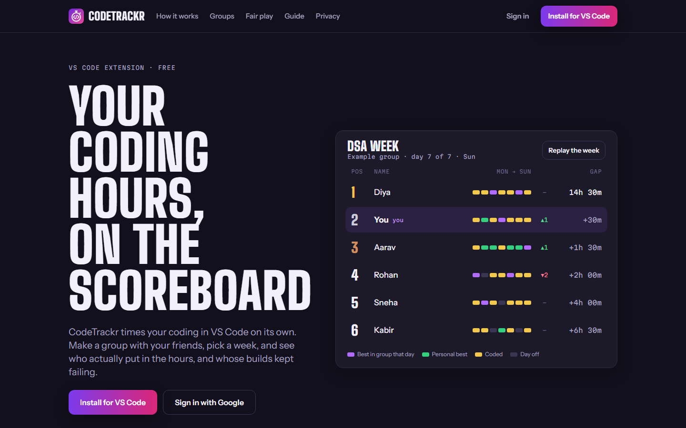
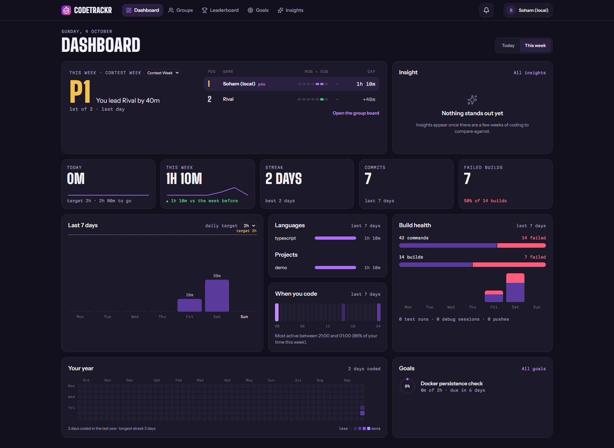
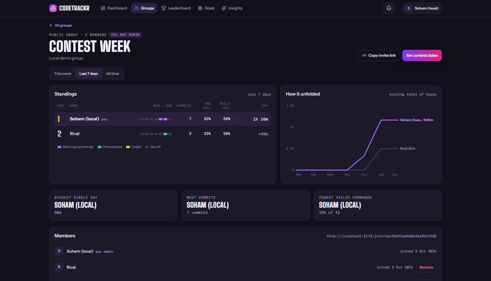
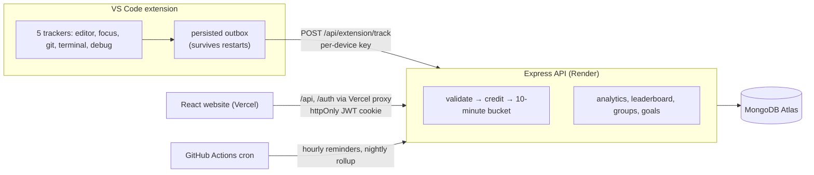

# CodeTrackr

**Your coding hours, on the scoreboard.** A VS Code extension tracks your coding time on its own,
and a website turns it into a dashboard, goals, a global leaderboard and groups where friends race
each other week by week.

[](https://github.com/PratikJambhule/CodeTrackr/actions/workflows/ci.yml)
[](https://marketplace.visualstudio.com/items?itemName=CodeTrackr-ext.codetrackr-vscode)

- **Website:** https://code-trackr-frontend.vercel.app
- **Extension:** [CodeTrackr for VS Code](https://marketplace.visualstudio.com/items?itemName=CodeTrackr-ext.codetrackr-vscode)



## Features

- **Automatic tracking.** After about two minutes of real activity the extension sends one small
  summary: active time, language, project name, edit counts, commits, and terminal commands with
  their exit codes. Never file contents, diffs or full paths.
- **Weekly race.** Every group has a board: an F1-style standings tower (one cell per day, gap to the
  leader), a race chart of running totals, highlights, and contest dates you can share as a link.
- **Dashboard.** Your race, today and this week, a year heatmap, languages and projects, when you
  code, build health, goals and the top insight.
- **Leaderboard.** Everyone ranked by hours, all time or the last 7 / 30 days.
- **Goals.** "N hours of X by a date", with progress from matching time and one reminder per goal.
- **Insights.** Plain statistics over your own data (deep-work ratio, peak hours, cadence, rework)
  and 13 threshold rules. Every number shows "—" until there is enough data. Not machine learning.
- **One-click sign-in for VS Code.** *CodeTrackr: Sign In* shows a code; approve it on the website
  and that computer gets its own revocable key, stored in the OS keychain.





## How it works



- **Credited, not trusted, time.** An upload counts only as far as window-focus time vouches for it,
  capped at 600 s per user per 10-minute window with an atomic counter, so a script cannot farm hours.
- **Ten-minute buckets.** Uploads are merged with one atomic `$inc` upsert per (user, project,
  language, 10 minutes): about 5× fewer documents and 13× less data than one document per upload
  (local benchmark at the 2-minute upload cadence).
- **Idempotent uploads.** Each upload carries an id; a retry after a dropped connection is applied once.
- **Running totals.** The all-time leaderboard reads one stats row per user instead of scanning all
  activity: 6.7 s → 62 ms at 1M rows in a local benchmark (`backend/bench/`).
- **One site for the browser.** Vercel forwards `/api` and `/auth` to the API, so the login cookie is
  first-party, which browsers that block third-party cookies (Safari, private windows) require.

## Tech stack

| Layer | Stack |
|---|---|
| Extension | TypeScript, esbuild, VS Code API (shell integration, Git API, SecretStorage) |
| Backend | Node.js, Express 5, Mongoose 8, Passport (Google OAuth 2.0), JWT cookie, helmet, express-rate-limit |
| Database | MongoDB Atlas |
| Frontend | React 19, Vite 7, TypeScript, Tailwind CSS (dark + light design tokens), React Router 7, TanStack Query 5, hand-made SVG charts |
| Testing | `node:assert` unit tests, supertest + mongodb-memory-server integration tests, Vitest + Testing Library |
| Hosting & CI | Render (API), Vercel (website), GitHub Actions (CI, scheduled jobs), Docker |

## Getting started

### Run everything with Docker

Needs Docker Desktop (running). From the project folder:

```bash
docker compose up --build
```

Open http://localhost:5173. This starts MongoDB 7, the API (seeded with demo data) and the website
with live reload. You are signed in as a demo user; Google sign-in is replaced by a local-only
bypass that the API refuses in production. Stop with `Ctrl+C`; `docker compose down -v` also deletes
the local data.

### Run without Docker or any accounts

Needs Node.js 22.12 or newer (24 recommended).

```bash
cd backend && npm install && npm run dev:local
```

```bash
cd frontend && npm install && npm run dev
```

The API runs on an in-memory MongoDB with demo data for every page (about ten months of activity,
friends, groups, goals). Data is gone when the process stops. To run it next to Docker, use
`DEV_PORT=5051 node scripts/dev-local.js` and `VITE_API_URL=http://localhost:5051 npx vite --port 5174`.

### Run against your own MongoDB and Google sign-in

```bash
cd backend && cp .env.example .env
```

Fill in `MONGO_URI`, `JWT_SECRET`, `GOOGLE_CLIENT_ID`, `GOOGLE_CLIENT_SECRET` and
`GOOGLE_CALLBACK_URL` (`http://localhost:5050/auth/google/callback`), then `npm run dev` in
`backend/` and `npm run dev` in `frontend/`.

### Try the extension locally

```bash
cd extension && npm install && npm run build
```

```bash
code --new-window --user-data-dir ./.vscode-test-profile --extensions-dir ./.vscode-test-ext --extensionDevelopmentPath "$(pwd)/extension" path/to/any/folder
```

In that window set `codetrackr.apiBase` to `http://localhost:5050` and run **CodeTrackr: Sign In**.

## Tests

```bash
cd backend && npm test && npm run test:int
```

```bash
cd extension && npm test
```

```bash
cd frontend && npm run lint && npm test && npm run build
```

375 backend unit assertions, 42 API integration tests (the real Express app over HTTP against an
in-memory MongoDB), 70 extension assertions and 54 frontend tests. Frontend tests run in the India
time zone, where the date bugs showed up. CI runs all of them, plus a Docker build with a health
check, on every push.

## Project structure

```
backend/     Express API: routes/, services/, models/, middleware/, tests/, scripts/, bench/
frontend/    React website: src/pages, src/components (ui, charts, layout), src/lib, src/hooks
extension/   VS Code extension: src/ (trackers, outbox, sign-in), tests/
.github/     CI, scheduled jobs, deploy workflow
```

## Privacy

The extension sends counts and durations, the language, the project (folder) name, and terminal
commands by type with their exit codes. A command that fails repeatedly is sent with anything that
looks like a password, token or key replaced by `***`. File contents, diffs and full paths are never
sent. The website's privacy page explains it in full.

## Team

Pratik Jambhule, Kartik Kharat, Soham Budhewar. The extension is MIT-licensed (`extension/LICENSE`).
