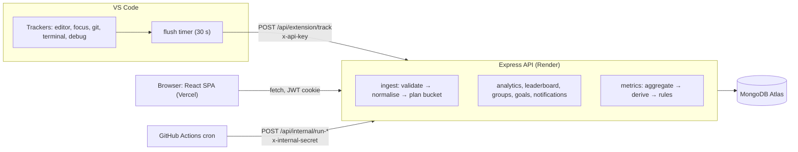

# CodeTrackr — Architecture

_Rewritten 2026-10-03 from the code on `main` (`92b899b` + working tree). The previous version
(verified 2026-08-28, extension 2.1.0) described per-flush documents, the `date` field and
unauthenticated analytics, all of which are gone. For line-level detail see
`CODETRACKR_PROJECT_CONTEXT.md`; for known defects see `docs/IMPROVEMENT_PLAN.md`._

## 1. Components

| Component | Where | What it does |
|---|---|---|
| VS Code extension 2.4.0 | `extension/src/*.ts` → `dist/extension.js` | Five trackers collect counters; a 30 s timer decides when to upload one summary. |
| Express API | `backend/app.js`, `routes/`, `services/`, `models/` | One process (a modular monolith). Feature routers, a thin service layer for ingest and insights, a central error handler. |
| MongoDB Atlas | 13 collections | `activities` is the only high-volume one. |
| React SPA | `frontend/src/` | Pages: Login, Onboarding, Dashboard, Insights, Leaderboard, Goals, Groups, Profile, Device (approve a VS Code sign-in). Reads use React Query (`src/api.ts`). |
| Scheduler | `.github/workflows/cron.yml` | Calls two secret-protected internal routes: hourly goal-deadline sweep, nightly daily-summary rollup. |

Static figures (architecture, DFD level 0/1, use cases, class diagram, ML pipeline) are in
`docs/images/figure-*.png`, with HTML sources in `docs/diagrams-src/`.

## 2. Write path: from keystroke to database

1. **Collect.** `EditorTracker` counts gross inserts/deletes, churn, saves, undo/redo, file
   switches and read-vs-write time. `FocusTracker` measures window-focus time and *flow blocks*
   (a block ends after 2 minutes idle). `GitStateTracker` counts commits by watching `HEAD` through
   the built-in Git extension. `TerminalTracker` uses shell-integration events to classify each
   command (git, npm, build, test, ...) and record its exit code. `DebugTracker` counts debug
   sessions.
2. **Decide when to send.** Every 30 s: if idle ≥ 2 min, flush and pause; otherwise flush once
   ≥ 2 minutes of active time are buffered **and** the interval has real signal (an edit, save,
   command, commit or flow block). A signal-less or failed flush is *held* in memory and merged
   into the next one.
3. **Authenticate.** `verifyApiKey` looks the `x-api-key` header up with `User.findOne({ apiKey })`.
4. **Validate.** `ingestValidation.js` rejects duration outside (0, 3600] s, over-long strings and
   timestamps outside [now − 24 h, now + 60 s].
5. **Normalise.** `activityNormalizers.js` coerces every counter, drops negatives, caps arrays.
6. **Bucket.** `activityBucket.planActivityWrite` floors the timestamp to a 10-minute grid and
   issues one atomic `findOneAndUpdate(..., { $inc, $max, $push, $addToSet }, { upsert: true })`
   keyed by `(userId, projectName, language, bucketStart)`. A partial unique index makes
   concurrent upserts safe (a duplicate-key race retries without the insert). Only non-zero
   counters are written, so documents stay sparse.

7. **Credit, don't trust (since 2026-10-03).** Before the write, the upload's time is limited to
   its focus time + 120 s, spread over the 10-minute windows it covers, and claimed against an
   atomic per-user window counter (`windowusages`) capped at 600 s. `duration` stores the credited
   seconds, `claimedDuration` the raw claim. An optional `flushId` makes a resend a no-op
   (`ingestreceipts`, 48 h TTL).

Result: roughly one document per 10 minutes per project-language pair instead of one per
upload. Setting `ACTIVITY_BUCKET_MS=0` restores one document per upload.

## 3. Read paths

| Request | How it is computed | Cost |
|---|---|---|
| `GET /api/analytics/:userId` (today), `/weekly` | one `$facet` pipeline (`services/analyticsViews.js`) over today / the last 7 local days | Response size independent of document count (M-1 fixed) |
| `GET /api/analytics/timeslot/:userId` | `Activity.find()` of a 2-hour window, reduced in JavaScript | Bounded by the window |
| `GET /api/analytics/summary/:userId` | `$group` pipeline by day and language | All of the user's history |
| `GET /api/metrics` | `metricsService` runs `$group` pipelines → `metricsDerive` (pure functions) → `sessionize` → `insightsBaseline` (90-day baseline cached once a day in `userinsights`) → `rulesEngine` | Measured 239 ms cold, 44 ms warm |
| `GET /api/leaderboard` | Top N `userstats` rows + two indexed maxima; `?days=` windows scan activities | O(N) all-time (H-7 fixed); windowed scan bounded by the window |
| `GET /api/groups/:id/details` | Members' `userstats`; `?from=&to=` scans that window | O(members) all-time (H-8 fixed) |
| `GET /api/goals/:id/progress` | `$match` on language or project (case-insensitive, regex-escaped) inside the goal's lifetime, `$sum` duration | One user, one window |

Every per-user route takes the user from the session. The four `/:userId` analytics routes keep
the parameter for the old dashboard but reject any id that is not the caller's (H-1).
`/api/metrics` has no id parameter at all.

**Rollup.** `services/dailyRollup.js` writes one `dailysummaries` document per user per UTC day,
nightly via `/api/internal/run-rollup`. Nothing reads it yet. It exists so the all-time reads
can stop scanning raw activities (the planned `UserStats` step).

## 4. Identity and security

| Who | Credential | Checked by |
|---|---|---|
| Browser | Google OAuth → JWT `{id, name, email, isFirstLogin}` (1 day) in an httpOnly cookie, `SameSite=None; Secure` in production | `isAuthenticated`: verify JWT, load user |
| Extension | `ct_<id>_<secret>` key — either the profile key or a per-device key from **Sign In** (device-code flow, `devicetokens`, 1-year expiry); server stores only SHA-256(secret); extension 2.5.0 keeps it in SecretStorage | `verifyApiKey`: look up the id in `users` then `devicetokens`, constant-time compare of the hash (legacy keys by their hash) |
| Scheduler | `INTERNAL_CRON_SECRET` header | constant-time compare; 404 when wrong or unset |

Cross-cutting: `helmet`, CORS allow-list (`FRONTEND_URL` + localhost), per-IP rate limits on
`/auth` (50 / 15 min), `/api/extension` and `/api/analytics` (120 / min), group join
(10 / 15 min); group passwords hashed with scrypt; `AUTH_BYPASS` refused in production; a central
error handler that returns `{ error, id }` and maps `CastError`/`ValidationError` to 400.

Open weaknesses that sit in this layer: non-expiring, unscoped API key; the auth cookie is
third-party between `vercel.app` and `onrender.com` (H-19); IP-keyed limits punish a shared
campus network (H-20); H-21, M-28/29 and L-11 were fixed on 2026-10-03.

## 5. Data model

| Collection | Shape | Notes |
|---|---|---|
| `activities` | `userId` (String), `projectName`, `language`, `bucketStart`, `duration` (seconds), `linesAdded/Removed`, `files[]`, `flushCount`, sparse `editorAnalytics`, `focusAnalytics`, `gitAnalytics`, `terminalAnalytics` | Indexes: `{userId, timestamp}`, `{userId, projectName}`, `{userId, language}`, partial-unique bucket key, 400-day TTL on `createdAt` |
| `dailysummaries` | one per (user, UTC day) | Written by the rollup, not yet read |
| `windowusages`, `ingestreceipts` | anti-cheat window counters; idempotency receipts | both expire after 48 h |
| `userstats` | one row of running totals per user | read by the all-time leaderboard and group boards |
| `deviceauths`, `devicetokens` | pending device sign-ins (10 min TTL); issued per-device keys | only hashes of codes and secrets |
| `userinsights` | cached 90-day baseline per user | Refreshed on read, at most daily |
| `users` | `googleId`, `email`, `apiKey` | |
| `groups`, `groupmembers` | group + join table with a unique `(groupId, userId)` index | Last member leaving deletes the group |
| `goals`, `notifications` | owner-scoped | Notifications created by the hourly sweep |

`activities.userId` is moving from String to ObjectId (M-6, roadmap item 10): new writes are
ObjectIds, reads match both forms through `services/activityUser.js`, and
`scripts/migrate-activity-userid.js` converts the old documents.

## 6. Deployment and operations

- **Backend:** Render web service, auto-deploys `main`, `node app.js`. `app.listen` and the
  in-process cron only start when the file is run directly, so `api/index.js` (Vercel serverless
  wrapper) can also import it safely; that config is unused today. `backend/Dockerfile` builds a
  portable image (Node 20 Alpine, production deps, non-root, `HEALTHCHECK` on `/health`).
- **Frontend:** Vercel. `frontend/vercel.json` forwards `/api/*` and `/auth/*` to the Render API and
  sends everything else to `index.html`. The production site calls its own address, so the browser
  sees one site and the login cookie is first-party (H-19). The extension still calls Render
  directly. Behind the proxy Render sees Vercel's IPs, so browser-facing rate limits key by user or
  session (`services/rateLimitKeys.js`).
- **Scheduler:** GitHub Actions, hourly + 03:30 UTC, with the same secret in GitHub and Render.
- **CI:** `.github/workflows/ci.yml` on every push and PR: backend unit tests + an import smoke
  of `app.js`, backend integration tests (in-memory MongoDB), extension tests, frontend build,
  and a Docker job that builds the image and waits for `/health` with `db:true`.
- **CD:** `.github/workflows/deploy.yml` triggers a Render deploy hook after green CI on `main`
  and waits for `/health` — inert until `RENDER_DEPLOY_HOOK_URL` is set (see `docs/RELEASE.md`).
- **Observability:** every request gets an id (`X-Request-Id`, also in error bodies); the server
  writes JSON lines — one access line per request, stack traces for 5xx — via
  `services/logger.js`; Sentry reporting switches on with `SENTRY_DSN`.
- **Local with Docker:** `docker compose up --build` starts three containers — `mongo` (MongoDB 7,
  data in a named volume, published on 27018), `backend` (the production `Dockerfile`, run with
  `NODE_ENV=development` + `AUTH_BYPASS`, `scripts/seed-local.js` seeds demo data once) and
  `frontend` (`frontend/Dockerfile.dev`, Vite dev server, `src/` bind-mounted for live reload).
  Containers reach each other by service name (`mongodb://mongo:27017`); the browser reaches the
  API on the laptop's `localhost:5050`.
- **Local:** `node backend/scripts/dev-local.js` runs the real API on an in-memory MongoDB with
  `AUTH_BYPASS` and demo data; benchmarks live in `backend/bench/` (`docs/BENCHMARKS.md`).

## 7. Where it breaks first at scale (after the October 2026 work)

1. **Windowed leaderboards** (`?days=`, group `?from=&to=`) still aggregate raw activity in the
   window. All-time boards read `userstats` (measured 62 ms p50 at 1M rows vs 6.7 s for the scan).
   Next step: per-day stats rows (or the existing `dailysummaries`) for windowed boards.
2. **Ingest does several writes per upload** (receipt, window counter, bucket, stats). Throughput
   matched the single-insert path locally (~450 req/s), but at much higher volume a queue in front
   of the database (and batching the stats `$inc`) becomes the next move.
3. **One region, one free instance:** Render's free tier sleeps (~22 s cold start, L-10) and the
   cookie is third-party across `vercel.app`/`onrender.com` (H-19). Both are hosting decisions,
   not code.
