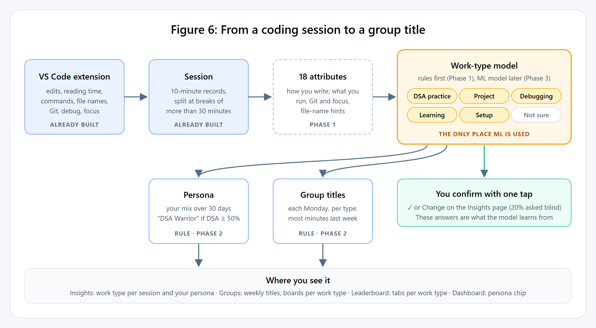
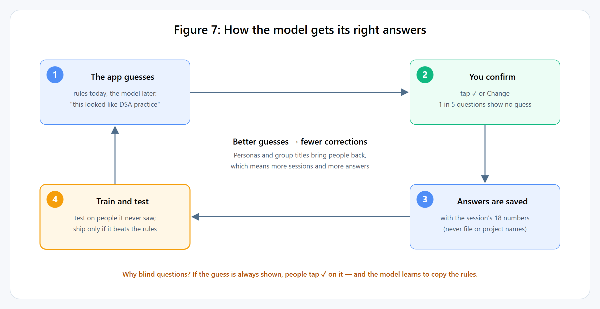

# CodeTrackr — The ML Integration, Explained Simply

**Status: a plan, not built.** Written 2026-09-17 to explain `docs/ML_INTEGRATION_PLAN.md` (the design)
and `docs/ML_INTEGRATION_CHANGES.md` (the file-by-file changes) in simple words, with worked examples.
The numbers in the examples are made up to show the method; the facts about the code were checked on
2026-09-17.

## 1. The whole idea in five sentences

1. Every coding session gets a **work type**: DSA practice, project building, debugging, learning, or setup.
2. At first simple **rules** decide the work type; later a **machine-learning model** does, but only if
   it proves to be more accurate.
3. You **confirm or correct** the work type with one tap, and those answers are what the model learns from.
4. Your mix of work types over 30 days gives you a **persona** such as "DSA Warrior".
5. Each week, the person who did the most of each work type in a group wins a **title** such as
   "DSA Warrior of CSE-Gang".

## 2. Why ML here, and not somewhere else

We only use machine learning when all five answers are "yes":

| Question | Why it matters |
|---|---|
| Do users care about the result? | Otherwise it is ML for show |
| Would simple rules do it badly? | If rules work, ML only adds complexity |
| Can we check it is correct? | If we cannot measure accuracy, we cannot claim it works |
| Is a wrong answer harmless? | These are friends competing in a group |
| Can we explain the output? | Every number in CodeTrackr is explainable |

**How the ideas we discussed scored:**

| Idea | Result | In simple words |
|---|---|---|
| Skill level (beginner / moderate / advanced) | ❌ | Typing a lot does not make you advanced. There is no answer key, so it can never be checked. Calling a friend "Beginner" in public hurts, and anyone could game it by typing more. |
| Personas made directly by k-means | ❌ | k-means makes groups but cannot name them. We would guess the names and could never check the guess. |
| Skill level + persona together | ❌ | Has the problems of both. |
| **Work type → persona → group titles** | ✅ | Users care, rules fail at it (section 4), user taps give a way to check it, every title is positive, and the model can explain each answer. |

Instead of a skill level, CodeTrackr already shows **"better than your own usual"**: the ▲ 92% next to
a metric compares you with your own last 90 days, never with other people.

## 3. The five work types

| Work type | What it usually looks like | Persona if it is ≥ 50% of your time |
|---|---|---|
| **DSA practice** | `two_sum.cpp`, compile, run, fix, repeat; no Git | DSA Warrior |
| **Project building** | many files, commits, `npm install`, builds and tests | Project Grinder |
| **Debugging** | debugger, failing builds or tests, little new code | Debugging King |
| **Learning & exploring** | mostly reading, jumping between files, little typing | Code Explorer |
| **Setup & config** | `npm`, `pip`, `docker`, `package.json`, `.env`; almost no code | Setup Wizard |

Two answers are not work types:

- **Not enough activity** — under 5 minutes, or nothing was edited or run.
- **Not sure** — the model is less than 50% confident, so the app asks you instead of guessing.

## 4. Why the rules cannot do this well: a real example

Take one session:

- **Folder and files:** folder `leetcode`, files `two_sum.cpp` and `valid_parentheses.cpp`
- **Active time:** 45 minutes
- **Writing:** 60 lines written, 15 deleted
- **Terminal:** 7 `g++` compiles (3 failed), 7 runs of `./a.out`
- **Git:** no commits

**What today's rules say: "debug grind".** The code counts `g++` as a *build*, and the debugging rule
fires on "2 or more failed builds and under 4 lines a minute". This session had 3 failed compiles and
wrote 1.67 lines a minute, so it matches.

**What it really was:** DSA practice. Compile errors are a normal part of solving a problem.

No single number gives it away. It takes a **combination**: files named like problems, only one or two
files, compile-and-run commands, no commits, no package installs. Weighing many signals together is
exactly what a model is good at, and what a chain of if-statements is bad at.

## 5. How a session becomes 18 numbers

The extension already sends everything needed. The same example session becomes:

| Attribute | How it is calculated | Value |
|---|---|---|
| `linesPerMin` | (lines written + deleted) ÷ active minutes = 75 ÷ 45 | 1.67 |
| `churnRatio` | lines deleted within 10 min of writing ÷ lines written = 12 ÷ 60 | 0.20 |
| `readRatio` | reading time ÷ (reading + typing) = 20 ÷ 35 minutes | 0.57 |
| `pasteShare` | characters that arrived in big chunks ÷ all characters inserted | 0.00 |
| `switchesPerMin` | file switches ÷ active minutes = 9 ÷ 45 | 0.20 |
| `filesTouched` | different files, capped at 10 | 2 |
| `commandsPerMin` | commands ÷ active minutes = 14 ÷ 45 | 0.31 |
| `runShare` | gcc / java / python commands ÷ all commands = 7 ÷ 14 | 0.50 |
| `packageShare` | npm / pip / docker commands ÷ all commands | 0.00 |
| `commandFailRatio` | failed commands ÷ all commands = 4 ÷ 14 | 0.29 |
| `buildFailRatio` | failed builds ÷ builds = 3 ÷ 7 | 0.43 |
| `testShare` | test runs ÷ all commands | 0.00 |
| `debugPerHour` | debugger sessions per active hour | 0.00 |
| `commitsPerHour` | Git commits per active hour | 0.00 |
| `deepShare` | time in 25+ minute stretches ÷ all stretch time = 28 ÷ 38 | 0.74 |
| `problemFileShare` | files named like problems ÷ files = 2 ÷ 2 | 1.00 |
| `configFileShare` | config files ÷ files | 0.00 |
| `practiceFolder` | folder named like `leetcode`, `dsa`, `cp`… (1 = yes) | 1 |

**Left out on purpose:**
- **Session length:** it says how *big* a session was, not what *kind*.
- **Raw file and folder names:** privacy, and the model would memorise names instead of learning patterns.
- **Time of day:** it says *when*, not *what*.
- **Language:** C++ is used for DSA and for projects, so the model could learn a stereotype.
- **Who you are:** the model must work for people it has never seen.

## 6. How the model decides: logistic regression in plain words

Think of it as a **points table**:

1. **Scale.** Each attribute becomes "how far above or below an average session" this one is. Here
   +2.0 means well above average and −1.0 means below.
2. **Score.** Each work type has a weight for each attribute. Multiply each attribute by its weight
   and add the results: that is the work type's score.
3. **Convert.** Scores become percentages with *softmax*: raise *e* (≈ 2.718) to each score, then
   divide by the total.
4. **Decide.** The highest percentage wins. If it is below 50%, the answer is *Not sure*.

**Worked example** with 3 attributes and 3 work types, to keep it small:

| Scaled attribute | Value | DSA weight | Project weight | Debugging weight |
|---|---|---|---|---|
| `problemFileShare` | +2.0 | +1.5 | −1.0 | −0.2 |
| `commitsPerHour` | −1.0 | −0.5 | +1.2 | −0.3 |
| `buildFailRatio` | +0.5 | +0.2 | +0.1 | +1.5 |

Scores:

- **DSA** = 1.5 × 2.0 + (−0.5) × (−1.0) + 0.2 × 0.5 = 3.0 + 0.5 + 0.1 = **3.60**
- **Project** = −1.0 × 2.0 + 1.2 × (−1.0) + 0.1 × 0.5 = −2.0 − 1.2 + 0.05 = **−3.15**
- **Debugging** = −0.2 × 2.0 + (−0.3) × (−1.0) + 1.5 × 0.5 = −0.4 + 0.3 + 0.75 = **0.65**

Percentages: e^3.60 ≈ 36.60, e^0.65 ≈ 1.92, e^−3.15 ≈ 0.04; total ≈ 38.56.

- DSA = 36.60 ÷ 38.56 ≈ **95%** → the answer is **DSA practice**
- Debugging ≈ 5%, Project ≈ 0.1%

**Why this model is explainable:** the biggest single contribution to DSA was `problemFileShare`
(1.5 × 2.0 = 3.0 points). So the app can say *"mostly because your files looked like practice problems"*.

**A "Not sure" example:** scores of 1.0, 0.9 and 0.8 become 37%, 33% and 30%. Nothing reaches 50%, so
the app asks you. Those are the most useful answers for the model to learn from.

**Where the weights come from:** training. The computer tries weights, checks how many confirmed
answers they get right, adjusts them, and repeats until they stop improving.

**How it runs in the app:** training happens once, on a laptop, in Python. The finished weights are
saved as a small JSON file in the repo, and JavaScript on the server does the three steps above.
There is no Python server in production.

## 7. Where the right answers come from

A model can only learn from examples that come with the right answer, called **labels**. CodeTrackr
gets them from you:

- **One tap:** each session on the Insights page shows the current guess with **✓** and **Change**.
- **Blind questions:** 1 in 5 times, the app shows **no guess** and asks "What was this session?".
- **Obvious cases:** a session in a folder called `leetcode` can be labelled DSA automatically. These are
  called *weak labels*.

**Two traps, and how the plan avoids them**

| Trap | What goes wrong | Fix |
|---|---|---|
| **Copying the rules** | If the guess is always shown, people tap ✓ without thinking. The model then learns to copy the rules, and "better than the rules" becomes impossible to test. | Blind questions; accuracy is measured only on blind answers |
| **Leaking the answer** | If the folder name creates a label *and* is an attribute, the model learns "folder name = answer" and looks perfect while learning nothing | Weak labels are never used for testing, and `practiceFolder` is removed when training on them |

Each saved answer includes a copy of the session's 18 numbers, never the file or folder names.

## 8. How we will know the model works

**Step 1 — test on people it never saw.** Suppose Riya has 120 sessions and Kabir has 15. If we test on
some of Riya's sessions after training on her other ones, the model already knows her habits and scores
too well. A new classmate would get worse results than the score promised. So the data is split **by
person**: train on some people, test on others, five times over.

**Step 2 — measure each work type.** Say the test people have 20 real DSA sessions:

| Real ↓ / Model said → | DSA | Project | Debugging |
|---|---|---|---|
| **DSA** (20) | **16** | 1 | 3 |
| **Project** (25) | 1 | **22** | 2 |
| **Debugging** (10) | 1 | 2 | **7** |

- **Precision** for DSA: the model said "DSA" 16 + 1 + 1 = 18 times and was right 16 times → 16 ÷ 18 = **89%**.
- **Recall** for DSA: of 20 real DSA sessions it caught 16 → 16 ÷ 20 = **80%**.
- **F1** combines the two: 2 × 0.89 × 0.80 ÷ (0.89 + 0.80) ≈ **0.84**.
- **Macro-F1** is the average F1 over all work types, so a rare type counts as much as a common one.
- **What the table shows:** 3 DSA sessions were called Debugging — the compile-error mix-up from section 4.

**Step 3 — beat the rules.** The rules are scored the same way on the same blind answers. For example:

| | Macro-F1 | Setup recall |
|---|---|---|
| Rules v1 | 0.71 | 0.60 |
| Model | 0.79 | 0.58 |

The model is 0.08 better overall, which clears the required +0.05. No work type drops more than 0.05
(Setup drops 0.02). **It ships.** If it had failed either check, the rules would stay, and that result
gets written down too.

**Step 4 — fairness checks.** Accuracy is also broken down per person and per language, so one heavy
user or one language cannot hide a failure somewhere else.

## 9. From work types to personas

Your last 30 days, counted in minutes:

| DSA | Project | Debugging | Learning | Setup | Total |
|---|---|---|---|---|---|
| 540 | 240 | 120 | 60 | 40 | 1000 |

DSA is 540 ÷ 1000 = **54%**, which is at least 50%, so you are a **DSA Warrior**. The app shows it with the
numbers: *"54% of your coding minutes this month were DSA practice."*

**Other cases:**

| Situation | Persona |
|---|---|
| DSA 40%, Project 35%, Debugging 25% (nothing reaches 50%) | **All-rounder** |
| Fewer than 5 classified sessions, or under 2 hours | **Warming up** |

The persona updates once a week, so it does not flicker, and you can hide it from groups.

## 10. Group titles

Every Monday, for each work type, the member with the most minutes last week wins a title. A title needs
**at least 60 minutes** of that type, and the group needs **at least 3 active members**.

Example group **CSE-Gang**, last week's minutes:

| Member | DSA | Project | Debugging | Learning | Setup |
|---|---|---|---|---|---|
| Riya | **300** | 60 | 20 | 30 | 0 |
| Kabir | 120 | **400** | 90 | 0 | 45 |
| Sam | 90 | 380 | **95** | 45 | 20 |

| Title | Winner | Why |
|---|---|---|
| DSA Warrior of CSE-Gang | Riya | 300 minutes, the most |
| Project Grinder of CSE-Gang | Kabir | 400 beats 380 |
| Debugging King of CSE-Gang | Sam | 95 beats 90, and is over 60 |
| Code Explorer | nobody | the best was 45 minutes, under 60 |
| Setup Wizard | nobody | the best was 45 minutes, under 60 |

**Why this matters:** today both the global and the group leaderboard rank only by total hours, so the
person who codes the most always wins. With titles, Riya, Kabir and Sam each lead at something. Each
winner also gets a notification.

## 11. What changes in the app

| Where | What you will see | Change IDs |
|---|---|---|
| **Insights** | Work type on each session with ✓ / Change; blind "What was this?"; a persona card with its numbers; *Too short to classify* renamed *Not enough activity* | C-08, C-10 |
| **Groups** | Emails no longer shown; "This week's titles"; board tabs (Hours · DSA · Projects · Debugging · Learning · Setup); this week / 30 days / all time; persona chips; group mix bar | C-02, C-11, C-12 |
| **Leaderboard** | The same work-type tabs; persona chips; a 30-day window; fake hours no longer count | C-01, C-13 |
| **Dashboard** | Persona chip and the titles you hold | C-14 |
| **Profile** | "Show my persona to groups" and "Ask me to confirm sessions" | C-14 |
| **Notifications** | "You're this week's DSA Warrior of CSE-Gang" | C-15 |
| **Extension** | Optional: report every file touched, not just the open one | C-09 |
| **Backend** | Sessions saved nightly; 18 attributes; work-type rules; persona and titles services; weekly job | C-04 to C-07, C-10, C-11 |
| **ML pipeline** | Export script, training notebook, JSON model, JavaScript prediction with a Python-match test | C-16 to C-19 |

The details, including API routes, database fields and tests, are in `docs/ML_INTEGRATION_CHANGES.md`.

## 12. Two problems to fix before anything else

Both were found while checking the code for this plan (2026-09-17):

- **H-21 — fake hours.** An upload may claim up to an hour, the server accepts 120 uploads a minute, and
  nothing stops a 10-minute record from holding more than 10 minutes. With your own API key and a small
  script you could add hundreds of hours and top the leaderboard. That would also poison training data,
  personas and titles.
  - **Fix:** a rule, not ML — cap each 10-minute record at 10 minutes.
  - **Careful:** a real offline hour arrives in one upload, so spread it across the 10-minute records it
    covers instead of cutting it.
- **M-28 — emails in groups.** The group page shows every member's email address to every other member,
  and anyone can join a public group. The global leaderboard had the same leak and it was fixed on
  2026-09-12; groups were missed.

The launch work (login on Safari and iPhone, campus rate limits, landing page) also comes first. Without
more people using the extension, there is nothing to learn from.

## 13. The order of work

| Phase | What gets built | Uses ML? | Time |
|---|---|---|---|
| 0 | Fix fake hours and group emails; launch; 10+ people using extension 2.4.0 | No | ~3 h + launch |
| 1 | Save sessions, 18 attributes, work-type rules (with DSA), one-tap and blind questions | No | ~25 h |
| 2 | Personas, weekly group titles, leaderboard and group tabs, notifications | No | ~23 h |
| 3 | Train, test and serve the model — once there are ~300 confirmed sessions from 10+ people, at least 30 per type | **Yes** | ~20 h |
| 4 | Optional: k-means on *Not sure* sessions to find a work type nobody thought of | Yes | ~6–8 h |

**Total: about 77–82 hours, plus time to collect data.**

Phases 1 and 2 are useful even if the model never ships: people get work types, personas and titles
from rules. Using those features is what produces the confirmed answers the model needs.

## 14. What we will not say

- That it measures **skill**. It describes what kind of work a session was.
- Any **accuracy number** before it is measured on people the model never saw.
- That a persona is a **personality**. It is last month's mix of coding.
- That it is **"AI"**. It is logistic regression, one of the simplest and most explainable models.
- That it is **built**. Today there is one active user and four detailed sessions.

## 15. Glossary

| Term | Meaning |
|---|---|
| **Machine learning** | The computer finds the rule from examples instead of a person writing it |
| **Model** | The finished result of training: here, a table of weights |
| **Attribute / feature** | One number describing a session, such as `linesPerMin` |
| **Label** | The right answer for an example, such as "this session was DSA" |
| **Supervised learning** | Learning from examples that have labels (this plan) |
| **Unsupervised learning** | Finding groups without labels (k-means) |
| **Weak label** | A label guessed automatically from an obvious sign, such as a `leetcode` folder |
| **Blind label** | An answer given without seeing the app's guess |
| **Training** | Adjusting the weights until they match the labels well |
| **Test set** | Examples held back to check the model, never used in training |
| **Split by person** | Test people are never in training, so the model cannot pass by memorising someone |
| **Overfitting** | Memorising the training examples instead of learning the pattern |
| **Data leakage** | The answer sneaks into the attributes, so the model looks better than it is |
| **Logistic regression** | Points per attribute per class, added up, then turned into percentages |
| **Softmax** | The step that turns scores into percentages that add up to 100% |
| **Decision tree** | A model that is a chain of yes/no questions; the plan's second candidate |
| **Class weights** | Making rare work types count as much as common ones during training |
| **Precision** | When the model says X, how often it is right |
| **Recall** | Of all real X, how many the model found |
| **F1 / macro-F1** | One number balancing precision and recall / its average over all classes |
| **Confusion table** | A grid of real answers against the model's answers, showing what it mixes up |
| **Baseline** | The thing to beat — here, the rules |
| **Active learning** | Asking people about the examples the model is least sure of |
| **k-means** | Splits examples into k groups by closeness; the groups have no names |
| **Elbow method / silhouette score** | Two ways to pick k and check whether the k-means groups are real |
| **Parity test** | Checks that JavaScript gives exactly the same answers as Python did |

## 16. Explaining it in an interview

**30-second version:**

> "I only used ML where rules failed: deciding what kind of coding a session was — DSA, project,
> debugging, learning or setup. My rules would label a LeetCode compile-error loop as debugging, because
> `g++` counts as a build. The model is logistic regression over 18 signals the extension already
> collects, learned from one-tap confirmations, with blind questions so people don't just agree with the
> rules. It's tested on people it never saw and only replaces the rules if it beats them. Personas and
> group titles are simple rules on top. I rejected skill levels because there's no way to validate them.
> It isn't built yet — the first two phases ship without ML and collect the labels."

**Likely questions:**

| Question | Answer |
|---|---|
| Why not predict skill level? | No answer key to check it against, a harmful label if wrong, and easy to game by typing more. |
| Why logistic regression and not a neural network? | A few hundred examples is far too little for a neural network. Logistic regression is explainable per attribute and fits in a small JSON file. A tree or boosting must clearly beat it to replace it. |
| Where do labels come from? | One-tap confirmations, blind questions, and weak labels that are never used for testing. |
| How do you stop it copying your rules? | Accuracy is measured only on blind answers. |
| Why split the test by person? | Otherwise it scores well by memorising one heavy user's habits. |
| What if the model loses to the rules? | The rules stay, and the result is written down. That is a valid outcome. |
| How is it served? | JSON weights in the repo, prediction in JavaScript, plus a test that JavaScript matches Python. |
| Where is k-means? | Optional discovery: clustering *Not sure* sessions to find a missing work type. |
| Biggest risk? | Not enough users. That is why the non-ML features ship first — they are what collect the data. |
